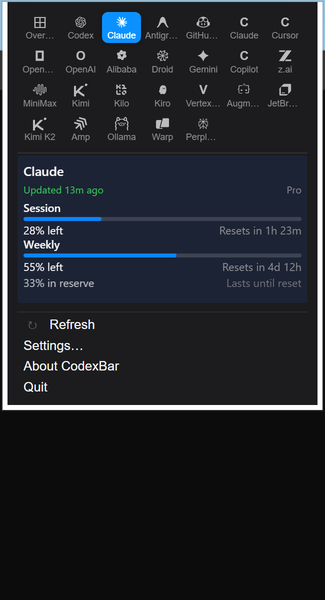

# Win-CodexBar

[简体中文说明](./README.zh-CN.md)

The Windows port of [CodexBar](https://github.com/steipete/CodexBar) — a system tray app that keeps your AI coding-tool usage limits visible at a glance.

> Built with **Tauri + React** on a shared **Rust** backend. The original CodexBar is a macOS Swift app by [Peter Steinberger](https://github.com/steipete).

<p align="center">
  
  &nbsp;&nbsp;
  
</p>

## Features

- **40 AI providers** — Codex, Claude, Cursor, Factory, Gemini, Copilot, Antigravity, z.ai, MiniMax, Kiro, Vertex AI, Augment, OpenCode, Kimi, Kimi K2, Amp, Warp, Ollama, OpenRouter, Synthetic, JetBrains AI, Alibaba, NanoGPT, Infini, Perplexity, Abacus AI, Mistral, OpenCode Go, Kilo, Codebuff, DeepSeek, Windsurf, Manus, Xiaomi MiMo, Doubao, Command Code, Crof, StepFun, Venice, OpenAI API
- **System tray icon** — dynamic two-bar meter showing session + weekly usage
- **Browser cookie import** — Chrome, Edge, Brave, Firefox, with browser access kept opt-in
- **Per-provider credentials** — API keys, cookies, and OAuth all managed from the provider detail pane
- **Credential hardening** — local secret-bearing stores are protected with Windows DPAPI on save
- **Windows release packaging** — Inno Setup installer, portable zip, WebView2 loader/runtime bootstrap, VC++ runtime bootstrap, and SHA-256 checksum files
- **CLI** — `codexbar usage` and `codexbar cost` for scripting and CI
- **WSL support** — CLI works out of the box; desktop shell via WSLg

## What's New in v0.25.0

- Ported upstream v0.25 provider support for **Manus**, **Xiaomi MiMo**, **Doubao**, **Command Code**, **Crof**, **StepFun**, **Venice**, and **OpenAI API balance** to the Windows/Tauri Rust backend.
- Added the new v0.25 providers to Settings → Providers, API-key management, cookie/token-account flows, provider search/aliases, and the tray/provider icon registry.
- Added multi-window usage support for provider-specific credit, request, refresh, balance, token-plan, and API-credit displays.
- Kept the `v0.25.1` upstream patch intentionally separate so `v0.25.0` can ship as its own verified Windows release first.

## Quick Start

```powershell
# Prerequisites: Node.js — Rust and MinGW are installed automatically
git clone https://github.com/Finesssee/Win-CodexBar.git
cd Win-CodexBar
.\dev.ps1
```

The script installs Rust/MinGW if needed, builds the Tauri desktop shell, and launches the app.

```powershell
.\dev.ps1 -Release          # optimised build
.\dev.ps1 -SkipBuild        # relaunch last build
```

## Download

Install with Windows Package Manager:

```powershell
winget install Finesssee.Win-CodexBar
```

Winget distribution is approved through [microsoft/winget-pkgs](https://github.com/microsoft/winget-pkgs/tree/master/manifests/f/Finesssee/Win-CodexBar). New releases may take a little time to appear in Winget after the GitHub release is published because each version is pinned to its own installer URL and SHA-256 hash.

You can also grab the latest build from [GitHub Releases](https://github.com/Finesssee/Win-CodexBar/releases).

- **Installer**: `CodexBar-<version>-Setup.exe`
- **Portable**: `CodexBar-<version>-portable.zip`
- **Checksums**: each release includes `.sha256` files for manual verification

The installer includes the desktop app, `WebView2Loader.dll`, Microsoft's Evergreen WebView2 bootstrapper, app icon, Start Menu shortcut, uninstall metadata, and the Visual C++ runtime bootstrap needed on clean Windows machines. The portable zip keeps `codexbar.exe`, `WebView2Loader.dll`, and `icon.ico` together for manual installs, so portable users still need WebView2 Runtime installed on the machine.

## First Run

1. Launch CodexBar — it sits in the system tray
2. Click the tray icon to open the usage panel
3. Open **Settings → Providers**, enable the services you use
4. For cookie-based providers, click the provider and use **Browser Cookies → Import**
5. For CLI-based providers (`codex`, `claude`, `gemini`), make sure you're logged in

## CLI

```bash
codexbar usage -p claude          # single provider
codexbar usage -p all             # all enabled providers
codexbar cost  -p codex           # local cost from JSONL logs
```

## Providers

| Provider | Auth | Tracks |
|----------|------|--------|
| Codex | OAuth / CLI | Session, Weekly, Credits |
| Claude | OAuth / Cookies / CLI | Session (5h), Weekly |
| Cursor | Cookies | Plan, Usage, Billing |
| Factory | Cookies | Usage |
| Gemini | gcloud OAuth | Quota |
| Copilot | GitHub Device Flow | Usage |
| Antigravity | Cookies / LSP | Usage |
| z.ai | API Token | Quota |
| MiniMax | API / Cookies | Usage |
| Kiro | Cookies / CLI | Monthly Credits |
| Vertex AI | gcloud OAuth | Cost |
| Augment | Cookies | Credits |
| OpenCode | Local Config | Usage |
| Kimi | Cookies | 5h Rate, Weekly |
| Kimi K2 | API Key | Credits |
| Amp | Cookies | Usage |
| Warp | Local Config | Usage |
| Ollama | Cookies | Usage |
| OpenRouter | API Key | Credits |
| JetBrains AI | Local Config | Usage |
| Alibaba | Cookies | Usage |
| NanoGPT | API Key | Credits |
| Infini | API Key | Session, Weekly, Quota |
| Perplexity | Cookies | Credits, Plan |
| Abacus AI | Cookies | Credits |
| Mistral | Cookies | Billing, Usage |
| OpenCode Go | Cookies | Usage |
| Kilo | API Key / CLI | Usage |
| Codebuff | API Key / Local Config | Credits, Weekly |
| DeepSeek | API Key | Balance |
| Windsurf | Local Cache | Daily, Weekly |
| Manus | Cookies | Credits, Refresh Credits |
| Xiaomi MiMo | Cookies | Balance, Token Plan |
| Doubao | API Key | Request Limits |
| Command Code | Cookies | Monthly Credits, Purchased Credits |
| Crof | API Key | Credits, Request Quota |
| StepFun | Oasis Token | 5h, Weekly |
| Venice | API Key | USD / DIEM Balance |
| OpenAI API | API Key | Credit Balance |

## Privacy

- **On-device only** — no data sent anywhere except provider APIs
- **No disk scanning** — only reads known config paths and browser cookies
- **Opt-in cookies** — extraction only runs for providers you enable
- **Protected credential stores** — app-managed API keys, manual cookies, and token accounts are written through the secure-file layer; on Windows this uses user-scoped DPAPI where available
- **Safe diagnostics** — diagnostic snapshots expose provider/source/status metadata only, never raw cookies, API keys, bearer tokens, or OAuth values
- **Verified updates** — automatic installer downloads require a GitHub SHA-256 digest and the installer is re-verified immediately before apply

## More Docs

| Topic | Link |
|-------|------|
| Building from source | [extra-docs/BUILDING.md](extra-docs/BUILDING.md) |
| WSL setup & auth tips | [extra-docs/WSL.md](extra-docs/WSL.md) |
| Browser cookie details | [extra-docs/COOKIES.md](extra-docs/COOKIES.md) |

## Credits

- **Original CodexBar**: [steipete/CodexBar](https://github.com/steipete/CodexBar) by Peter Steinberger
- **Inspired by**: [ccusage](https://github.com/ryoppippi/ccusage) for cost tracking

## License

MIT — same as the original CodexBar.

---

*For the macOS version, visit [steipete/CodexBar](https://github.com/steipete/CodexBar).*
