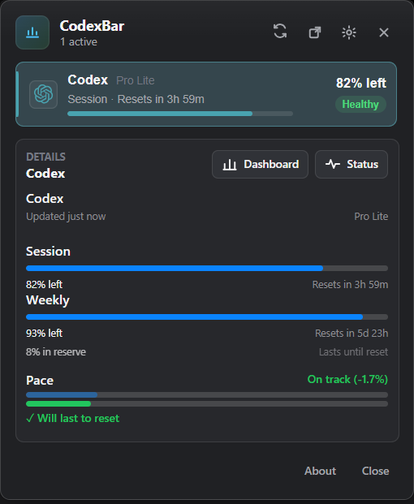
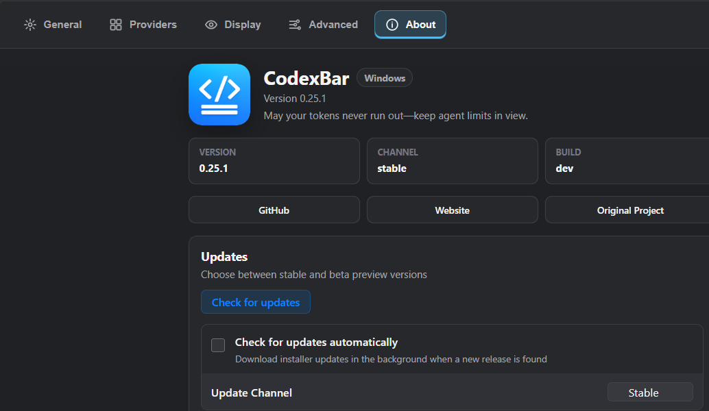

# CodexBar for Windows

[简体中文说明](./README.zh-CN.md)

CodexBar for Windows is a modern Tauri + React port of [CodexBar](https://github.com/steipete/CodexBar), the macOS menu bar app for keeping AI coding-tool usage limits visible at a glance.

> The Windows shell is implemented with **Tauri + React** on a shared **Rust** backend. The original CodexBar is a macOS Swift app by [Peter Steinberger](https://github.com/steipete) and upstream contributors.

<p align="center">
  
  &nbsp;&nbsp;
  
</p>

## Features

- **40 AI providers** — Codex, Claude, Cursor, Factory, Gemini, Copilot, Antigravity, z.ai, MiniMax, Kiro, Vertex AI, Augment, OpenCode, Kimi, Kimi K2, Amp, Warp, Ollama, OpenRouter, Synthetic, JetBrains AI, Alibaba, NanoGPT, Infini, Perplexity, Abacus AI, Mistral, OpenCode Go, Kilo, Codebuff, DeepSeek, Windsurf, Manus, Xiaomi MiMo, Doubao, Command Code, Crof, StepFun, Venice, OpenAI API
- **Modern Windows tray UI** — dense provider summary, clear usage state, provider actions, and Windows-friendly spacing
- **Modern Settings/About surface** — wider desktop settings window, Fluent-inspired grouped controls, and explicit upstream attribution
- **System tray icon** — dynamic two-bar meter showing session + weekly usage
- **Browser cookie import** — Chrome, Edge, Brave, Firefox, with browser access kept opt-in
- **Per-provider credentials** — API keys, cookies, and OAuth all managed from the provider detail pane
- **Credential hardening** — local secret-bearing stores are protected with Windows DPAPI on save
- **Windows release packaging** — Inno Setup installer, standalone portable exe, WebView2 runtime bootstrap, VC++ runtime bootstrap, and SHA-256 checksum files
- **Provider changelog links** — optional release-note shortcuts for supported CLI-backed providers
- **CLI** — `codexbar usage` and `codexbar cost` for scripting and CI
- **WSL support** — CLI works out of the box; desktop shell via WSLg

## Windows Migration Status

- Rebuilt and validated against the upstream **CodexBar 0.25.1** patch line.
- Ported the upstream provider changelog-link setting and supported provider URLs.
- Reworked the tray panel and Settings/About screens for a more native-feeling Windows desktop experience.
- Added a reproducible local release script for portable and installer assets.
- Preserved upstream MIT license attribution and linked the original project contributors.
- Verified with frontend tests, Rust tests, a Tauri debug build, release-asset dry run, and visual proof screenshots.

## Quick Start

```powershell
# Prerequisites: Node.js — Rust and MinGW are installed automatically
git clone https://github.com/zahedshareef/CodexBar.git
cd CodexBar
.\dev.ps1
```

The script installs Rust/MinGW if needed, builds the Tauri desktop shell, and launches the app.

```powershell
.\dev.ps1 -Release          # optimised build
.\dev.ps1 -SkipBuild        # relaunch last build
```

## Release Assets

Build local Windows release assets from the repository root:

```powershell
powershell -ExecutionPolicy Bypass `
  -File .\scripts\build-windows-release-assets.ps1
```

The script writes release-ready files under `rust\target\release-assets`:

- **Installer**: `CodexBar-<version>-Setup.exe`
- **Portable**: `CodexBar-<version>-portable.exe`
- **Checksums**: each release includes `.sha256` files for manual verification

Use `-SkipInstaller` to produce only the portable exe when Inno Setup is not installed.

The installer includes the desktop app, Microsoft's Evergreen WebView2 bootstrapper, app icon, Start Menu shortcut, uninstall metadata, and the Visual C++ runtime bootstrap needed on clean Windows machines. The portable exe is the same desktop app without installer integration; release builds statically link the WebView2 loader, so portable users only need the Microsoft Edge WebView2 Runtime installed on the machine.

## First Run

1. Launch CodexBar — it sits in the system tray
2. Click the tray icon to open the usage panel
3. Open **Settings → Providers**, enable the services you use
4. For cookie-based providers, click the provider and use **Browser Cookies → Import**
5. For CLI-based providers (`codex`, `claude`, `gemini`), make sure you're logged in

## CLI

```bash
codexbar usage -p claude          # single provider
codexbar usage -p all             # all enabled providers
codexbar cost  -p codex           # local cost from JSONL logs
```

## Providers

| Provider | Auth | Tracks |
|----------|------|--------|
| Codex | OAuth / CLI | Session, Weekly, Credits |
| Claude | OAuth / Cookies / CLI | Session (5h), Weekly |
| Cursor | Cookies | Plan, Usage, Billing |
| Factory | Cookies | Usage |
| Gemini | gcloud OAuth | Quota |
| Copilot | GitHub Device Flow | Usage |
| Antigravity | Cookies / LSP | Usage |
| z.ai | API Token | Quota |
| MiniMax | API / Cookies | Usage |
| Kiro | Cookies / CLI | Monthly Credits |
| Vertex AI | gcloud OAuth | Cost |
| Augment | Cookies | Credits |
| OpenCode | Local Config | Usage |
| Kimi | Cookies | 5h Rate, Weekly |
| Kimi K2 | API Key | Credits |
| Amp | Cookies | Usage |
| Warp | Local Config | Usage |
| Ollama | Cookies | Usage |
| OpenRouter | API Key | Credits |
| JetBrains AI | Local Config | Usage |
| Alibaba | Cookies | Usage |
| NanoGPT | API Key | Credits |
| Infini | API Key | Session, Weekly, Quota |
| Perplexity | Cookies | Credits, Plan |
| Abacus AI | Cookies | Credits |
| Mistral | Cookies | Billing, Usage |
| OpenCode Go | Cookies | Usage |
| Kilo | API Key / CLI | Usage |
| Codebuff | API Key / Local Config | Credits, Weekly |
| DeepSeek | API Key | Balance |
| Windsurf | Local Cache | Daily, Weekly |
| Manus | Cookies | Credits, Refresh Credits |
| Xiaomi MiMo | Cookies | Balance, Token Plan |
| Doubao | API Key | Request Limits |
| Command Code | Cookies | Monthly Credits, Purchased Credits |
| Crof | API Key | Credits, Request Quota |
| StepFun | Oasis Token | 5h, Weekly |
| Venice | API Key | USD / DIEM Balance |
| OpenAI API | API Key | Credit Balance |

## Privacy

- **On-device only** — no data sent anywhere except provider APIs
- **No disk scanning** — only reads known config paths and browser cookies
- **Opt-in cookies** — extraction only runs for providers you enable
- **Protected credential stores** — app-managed API keys, manual cookies, and token accounts are written through the secure-file layer; on Windows this uses user-scoped DPAPI where available
- **Safe diagnostics** — diagnostic snapshots expose provider/source/status metadata only, never raw cookies, API keys, bearer tokens, or OAuth values
- **Verified updates** — automatic installer downloads require a GitHub SHA-256 digest and the installer is re-verified immediately before apply

## More Docs

| Topic | Link |
|-------|------|
| Building from source | [extra-docs/BUILDING.md](extra-docs/BUILDING.md) |
| WSL setup & auth tips | [extra-docs/WSL.md](extra-docs/WSL.md) |
| Browser cookie details | [extra-docs/COOKIES.md](extra-docs/COOKIES.md) |

## Credits

- **Original CodexBar**: [steipete/CodexBar](https://github.com/steipete/CodexBar) by Peter Steinberger
- **Upstream contributors**: [steipete/CodexBar contributors](https://github.com/steipete/CodexBar/graphs/contributors)
- **Inspired by**: [ccusage](https://github.com/ryoppippi/ccusage) for cost tracking

## License

MIT — same as the original CodexBar.

---

*For the macOS version, visit [steipete/CodexBar](https://github.com/steipete/CodexBar).*
