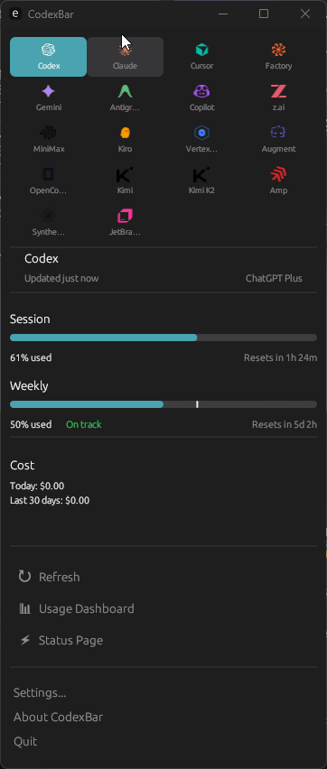
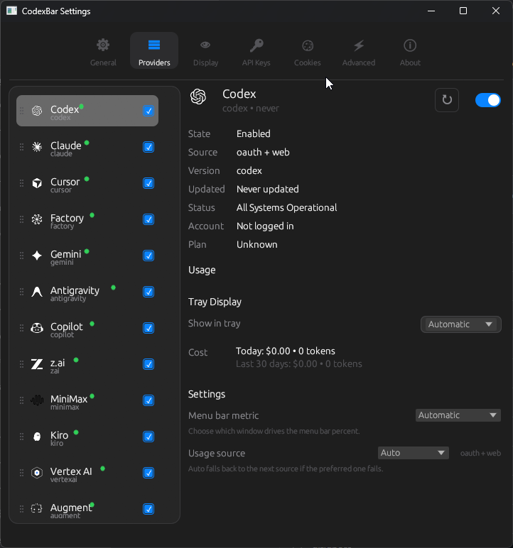
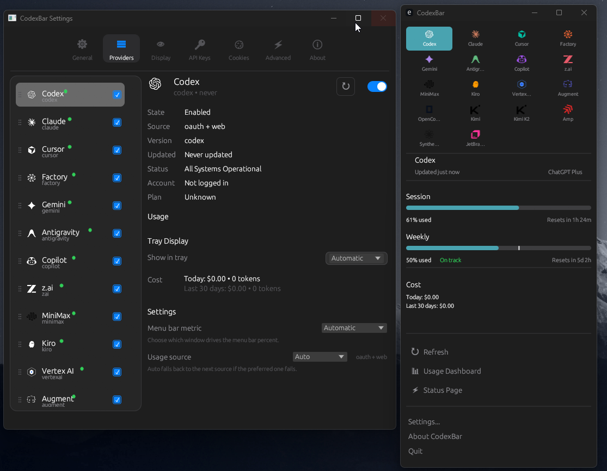

# Win-CodexBar — CodexBar 的 Windows 与 WSL 移植版

[English README](./README.md)

[CodexBar](https://github.com/steipete/CodexBar) 的 Windows（以及 WSL）移植版 —— 一个小巧的菜单栏应用，让你随时掌握各个 AI 服务商的用量额度。

> **这是官方 Windows 移植版。** 原版 CodexBar 是由 [Peter Steinberger](https://github.com/steipete) 开发的 macOS Swift 应用。本分支使用 Tauri 桌面壳层，并复用共享的 Rust 后端。

## 功能特性

- **16 个 AI 服务商**：Codex、Claude、Cursor、Gemini、Copilot、Antigravity、Windsurf、Zai、Kiro、Vertex AI、Augment、MiniMax、OpenCode、Kimi、Kimi K2、Infini
- **系统托盘图标**：动态双条进度显示会话与周用量
- **桌面壳层**：Tauri + React UI，底层复用共享 Rust 核心
- **浏览器 Cookie 提取**：自动从 Chrome、Edge、Brave、Firefox 提取（DPAPI 加密）
- **CLI 命令**：支持 `codexbar usage` 与 `codexbar cost`，方便脚本化
- **设置窗口**：可启用/禁用服务商、设置刷新间隔、管理 Cookies

## 截图

### 主窗口


### 设置


### Overview


## 快速开始

### 快速开始 — Windows

```powershell
# 克隆并运行 —— Rust/MinGW 依赖可自动安装，但请先安装 Node.js
git clone https://github.com/Finesssee/Win-CodexBar.git
cd Win-CodexBar
.\dev.ps1
```

它会执行以下操作：
1. 检查 Rust 和 MinGW-w64，缺失时自动安装
2. 通过 Tauri 的 no-bundle 工作流以 debug 模式构建桌面壳层
4. 启动桌面应用

其他选项：
```powershell
.\dev.ps1 -Release         # 优化构建
.\dev.ps1 -Verbose         # 输出调试日志
.\dev.ps1 -SkipBuild       # 跳过构建，直接运行上次构建结果
```

### 快速开始 — WSL（Ubuntu）

CodexBar 可在 WSL 中原生运行。CLI 开箱即用；桌面壳层需要 [WSLg](https://github.com/microsoft/wslg)（Windows 11，22000+）。

```bash
# 克隆并构建
git clone https://github.com/Finesssee/Win-CodexBar.git
cd Win-CodexBar
./dev.sh
```

它会执行以下操作：
1. 检测当前 WSL 环境
2. 通过 Tauri 的 no-bundle 工作流构建 CodexBar Desktop
4. 启动桌面壳层（WSLg）或 CLI（未检测到显示服务时）

仅 CLI 模式（无需显示服务）：
```bash
./dev.sh --cli              # codexbar usage -p all
./dev.sh --release          # 优化构建
```

#### WSL 支持的工作方式

在 WSL 中运行时，CodexBar 会：

- **浏览器 Cookies**：从 `/mnt/c/Users/<你>/AppData/...` 读取 Windows 浏览器数据。
  由于 Chromium Cookies 使用 DPAPI 加密，WSL 中无法自动解密。
  请改用手动 Cookies（设置 → Cookies）或基于 CLI 的服务商认证。
- **服务商 CLI**：支持在 WSL 内原生安装并使用 `codex`、`claude`、`gemini` 等命令。
- **桌面壳层**：需要 WSLg（Windows 11）或 X server。若不可用，会自动回退到 CLI 模式。
- **通知**：在 WSL 中使用 `notify-send`，若不可用则退回日志输出。

#### WSL 认证建议

| 服务商 | WSL 认证方式 |
|--------|--------------|
| Codex | 在 WSL 中执行 `npm i -g @openai/codex`，然后运行 `codex login` |
| Claude | 在 WSL 中执行 `npm i -g @anthropic-ai/claude-code`，然后运行 `claude login` |
| Gemini | 在 WSL 中执行 `gcloud auth login`（需安装 gcloud CLI） |
| Cursor / Kimi | 使用手动 Cookies —— 从浏览器 DevTools 复制（F12 → Network → Cookie header） |
| Copilot | GitHub Device Flow 可在 WSL 中原生工作 |

### 下载

最新版本请前往 [GitHub Releases](https://github.com/Finesssee/Win-CodexBar/releases) 下载。

### 手动构建

前置要求：Rust 1.70+、`x86_64-pc-windows-gnu` target、MinGW-w64，以及 Node.js/npm。
可通过以下命令自动安装：

```powershell
.\scripts\setup-windows.ps1
```

然后构建：
```powershell
cd apps/desktop-tauri
npm install
cd ../..
npm --prefix apps/desktop-tauri run tauri:build
# 二进制路径：target/release/codexbar-desktop-tauri.exe
```

## 使用方式

### 桌面壳层
```powershell
.\dev.ps1
# 或：cd apps/desktop-tauri && npm run tauri:dev
```

### CLI
```bash
# 查看某个服务商的用量
codexbar usage -p claude
codexbar usage -p codex
codexbar usage -p all

# 查看本地成本用量（来自 JSONL 日志）
codexbar cost -p codex
codexbar cost -p claude
```

## 支持的服务商

| 服务商 | 认证方式 | 跟踪内容 |
|--------|----------|----------|
| Codex | OAuth / CLI | 会话、周用量、Credits |
| Claude | OAuth / Cookies / CLI | 会话（5 小时）、周用量 |
| Cursor | 浏览器 Cookies | 套餐、用量、账单 |
| Gemini | OAuth（gcloud） | 配额 |
| Copilot | GitHub Device Flow | 用量 |
| Antigravity | 本地 Language Server | 用量 |
| Windsurf | 本地配置 | 用量 |
| Zai | API Token | 配额 |
| Kiro | CLI | 月度 Credits |
| Vertex AI | gcloud OAuth | 成本跟踪 |
| Augment | 浏览器 Cookies | Credits |
| MiniMax | API | 用量 |
| OpenCode | 本地配置 | 用量 |
| Kimi | 浏览器 Cookies | 5 小时速率、周用量 |
| Kimi K2 | API Key | Credits |
| Infini | API Key | 会话、周用量、配额 |

## 首次运行

1. 在仓库根目录运行 `.\dev.ps1`、`./dev.sh`，或执行 `cd apps/desktop-tauri && npm run tauri:dev` 启动桌面壳层
2. 在菜单中点击 **Settings**
3. 前往 **Providers** 标签页，启用你使用的服务商
4. 确保你已登录相应服务商 CLI（例如 `codex`、`claude`、`gemini`）

## 浏览器 Cookie 提取

Win-CodexBar 可自动从以下浏览器提取 Cookies：
- **Chrome**（DPAPI + AES-256-GCM）
- **Edge**（DPAPI + AES-256-GCM）
- **Brave**（DPAPI + AES-256-GCM）
- **Firefox**（未加密 SQLite）

对于依赖 Web 认证的服务商（如 Claude、Cursor、Kimi），只要你已登录网页版，Cookies 就会被自动提取。

> **WSL 提示**：Chromium Cookies 使用 Windows DPAPI 加密，而 WSL 无法访问 DPAPI。
> 因此，在 WSL 中运行 CodexBar 时，Chrome/Edge/Brave 的自动提取不可用。
> 请改用手动 Cookies 或基于 CLI 的服务商认证方式。

### 手动 Cookies

如果自动提取失败，可以手动添加 Cookies：
1. 打开 **Settings** → **Cookies**
2. 选择对应服务商
3. 从浏览器开发者工具中复制 Cookie header 并粘贴（F12 → Network → Request Headers → Cookie）

## 与 macOS 版本的区别

| 功能 | macOS | Windows | WSL |
|------|-------|---------|-----|
| UI 框架 | SwiftUI | Tauri + React（Rust 后端） | Tauri + React（通过 WSLg） |
| 系统托盘 | NSStatusItem | tray-icon crate | tray-icon（WSLg） |
| Cookie 解密 | Keychain | DPAPI | 手动 Cookies |
| Widget | WidgetKit | 不支持 | 不支持 |
| 自动更新 | Sparkle | 手动 | 手动 |
| 通知 | macOS 原生 | PowerShell toast | notify-send |

## 隐私

- **不扫描整个磁盘**：只读取已知配置路径和浏览器 Cookies
- **仅本地处理**：不会将数据发送到外部服务器（服务商 API 除外）
- **Cookies 为按需启用**：只有启用相应服务商后才会尝试提取浏览器 Cookies

## 致谢

- **原版 CodexBar**：[steipete/CodexBar](https://github.com/steipete/CodexBar)，作者 Peter Steinberger（MIT）
- **灵感来源**：[ccusage](https://github.com/ryoppippi/ccusage)，用于成本跟踪思路

## 许可证

MIT —— 与原版 CodexBar 保持一致

---

*如需原版 macOS 版本，请访问 [steipete/CodexBar](https://github.com/steipete/CodexBar)。*
