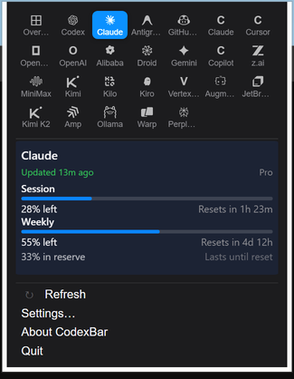

# Win-CodexBar

[English README](./README.md)

[CodexBar](https://github.com/steipete/CodexBar) 的 Windows 移植版 —— 一个系统托盘应用，让你随时掌握各个 AI 编程工具的用量额度。

> 基于 **Tauri + React** 构建，底层复用共享 **Rust** 后端。原版 CodexBar 是由 [Peter Steinberger](https://github.com/steipete) 开发的 macOS Swift 应用。

<p align="center">
  
</p>

## 功能特性

- **28 个 AI 服务商** — Codex、Claude、Cursor、Factory、Gemini、Copilot、Antigravity、z.ai、MiniMax、Kiro、Vertex AI、Augment、OpenCode、Kimi、Kimi K2、Amp、Warp、Ollama、OpenRouter、Synthetic、JetBrains AI、Alibaba、NanoGPT、Infini、Perplexity、Abacus AI、OpenCode Go、Kilo
- **系统托盘图标** — 动态双条进度显示会话与周用量
- **浏览器 Cookie 导入** — Chrome、Edge、Brave、Firefox（Windows DPAPI 解密）
- **逐服务商凭据管理** — API Key、Cookie 和 OAuth 均可在服务商详情面板管理
- **CLI** — `codexbar usage` 和 `codexbar cost`，便于脚本化和 CI
- **WSL 支持** — CLI 开箱即用，桌面壳层通过 WSLg 运行

## 快速开始

```powershell
# 前置要求：Node.js — Rust 和 MinGW 将自动安装
git clone https://github.com/Finesssee/Win-CodexBar.git
cd Win-CodexBar
.\dev.ps1
```

脚本会自动安装 Rust/MinGW（如缺失）、构建 Tauri 桌面壳层并启动应用。

```powershell
.\dev.ps1 -Release          # 优化构建
.\dev.ps1 -SkipBuild        # 跳过构建，直接启动
```

## 下载

前往 [GitHub Releases](https://github.com/Finesssee/Win-CodexBar/releases) 下载最新版本。

- **安装包**：`CodexBar-<version>-Setup.exe`
- **便携版**：`codexbar-desktop-tauri.exe`

## 首次运行

1. 启动 CodexBar — 它会驻留在系统托盘
2. 点击托盘图标打开用量面板
3. 前往 **Settings → Providers**，启用你使用的服务商
4. 对于基于 Cookie 的服务商，点击服务商后使用 **Browser Cookies → Import**
5. 对于基于 CLI 的服务商（`codex`、`claude`、`gemini`），请确保已登录

## CLI

```bash
codexbar usage -p claude          # 单个服务商
codexbar usage -p all             # 所有已启用的服务商
codexbar cost  -p codex           # 本地成本（JSONL 日志）
```

## 支持的服务商

| 服务商 | 认证方式 | 跟踪内容 |
|--------|----------|----------|
| Codex | OAuth / CLI | 会话、周用量、Credits |
| Claude | OAuth / Cookies / CLI | 会话（5h）、周用量 |
| Cursor | Cookies | 套餐、用量、账单 |
| Factory | Cookies | 用量 |
| Gemini | gcloud OAuth | 配额 |
| Copilot | GitHub Device Flow | 用量 |
| Antigravity | Cookies / LSP | 用量 |
| z.ai | API Token | 配额 |
| MiniMax | API / Cookies | 用量 |
| Kiro | Cookies / CLI | 月度 Credits |
| Vertex AI | gcloud OAuth | 成本 |
| Augment | Cookies | Credits |
| OpenCode | 本地配置 | 用量 |
| Kimi | Cookies | 5h 速率、周用量 |
| Kimi K2 | API Key | Credits |
| Amp | Cookies | 用量 |
| Warp | 本地配置 | 用量 |
| Ollama | Cookies | 用量 |
| OpenRouter | API Key | Credits |
| JetBrains AI | 本地配置 | 用量 |
| Alibaba | Cookies | 用量 |
| NanoGPT | API Key | Credits |
| Infini | API Key | 会话、周用量、配额 |
| Perplexity | Cookies | Credits、套餐 |
| Abacus AI | Cookies | Credits |
| OpenCode Go | Cookies | 用量 |
| Kilo | API Key / CLI | 用量 |

## 隐私

- **仅本地处理** — 不会将数据发送到外部服务器（服务商 API 除外）
- **不扫描磁盘** — 只读取已知配置路径和浏览器 Cookies
- **按需启用** — 只有启用相应服务商后才会提取 Cookies

## 更多文档

| 主题 | 链接 |
|------|------|
| 从源码构建 | [extra-docs/BUILDING.md](extra-docs/BUILDING.md) |
| WSL 设置与认证 | [extra-docs/WSL.md](extra-docs/WSL.md) |
| 浏览器 Cookie 详解 | [extra-docs/COOKIES.md](extra-docs/COOKIES.md) |

## 致谢

- **原版 CodexBar**：[steipete/CodexBar](https://github.com/steipete/CodexBar)，作者 Peter Steinberger
- **灵感来源**：[ccusage](https://github.com/ryoppippi/ccusage)，用于成本跟踪思路

## 许可证

MIT — 与原版 CodexBar 保持一致

---

*如需原版 macOS 版本，请访问 [steipete/CodexBar](https://github.com/steipete/CodexBar)。*
